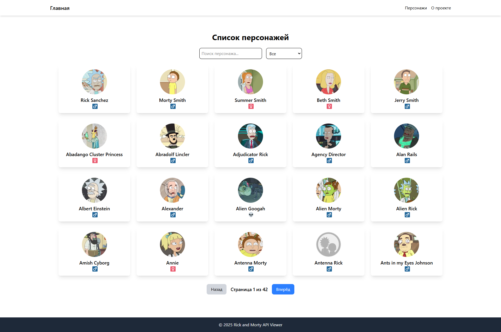

# 🔥 Rick and Morty API Viewer

Простое React-приложение, которое позволяет просматривать персонажей из вселенной **Rick and Morty**, используя **GraphQL API**.



---

## 📌 **Функциональность**

✅ **Главная страница** – список персонажей с фильтрацией и пагинацией  
✅ **Поиск** – поиск персонажей по имени  
✅ **Фильтр по полу** – фильтр по категориям (мужской, женский, неизвестный)  
✅ **Пагинация** – переключение между страницами  
✅ **Страница персонажа** – подробная информация (статус, раса, эпизоды)  
✅ **Адаптивный дизайн** – Tailwind CSS

---

## 🛠️ **Использованные технологии**

🔹 **Фреймворк:** React + Vite  
🔹 **Запросы к API:** Apollo Client (GraphQL)  
🔹 **Маршрутизация:** React Router  
🔹 **Стилизация:** Tailwind CSS  
🔹 **Система контроля версий:** Git + GitHub

---

# AEB

## Frontend разработчик. Version 4.

Задача: необходимо написать простое приложение с использованием https://rickandmortyapi.com/documentation

## Описание

На первой (домашней) странице должен быть представлен список ф# 🚀 Frontend разработчик. Version 4.

## 📌 Задача
Необходимо написать простое приложение с использованием **[Rick and Morty API](https://rickandmortyapi.com/documentation)**.

---

## 📌 Основные требования:
1️⃣ **Сайт должен иметь две страницы**.
2️⃣ **На главной странице** должен быть список персонажей в табличном виде **с пагинацией** (или бесконечным скроллом). В карточках персонажей должны быть:
   - 🖼️ **Аватарка**
   - 📇 **Имя**
   - 🚻 **Пол** (в виде SVG иконки)
3️⃣ **При нажатии на персонажа** открывается его страница с подробной информацией:
   - 📇 **Имя**
   - 📅 **Возраст** (дата создания)
   - 🚻 **Пол**
   - ❤️ **Статус** (жив/мертв/неизвестно)
   - 🎥 **Эпизоды, в которых появлялся персонаж**
   - 👽 **Раса**
4️⃣ **Дизайн — на усмотрение разработчика**.
5️⃣ **Адаптивная вёрстка** (`flexboxgrid`, `bootstrap`, etc).
6️⃣ **Проект должен быть выложен на GitHub** в публичном или приватном репозитории с инвайтом.

---

## 📌 Используемые технологии:
✅ **Фронтенд:**
- **React + Vite** 🚀 (вместо Angular)
- **JavaScript (ES6+)** (вместо TypeScript)
- **Tailwind CSS** (вместо SCSS)
- **React Router** (маршрутизация)
- **Apollo Client** (GraphQL API)

✅ **Дополнительно:**
- **ESLint + Prettier** (чистый код)
- **Git + GitHub** (контроль версий)


---

## 🚀 **Как запустить проект?**
```sh
# 1️⃣ Установить зависимости
npm install

# 2️⃣ Запустить сервер разработки
npm run dev

# 3️⃣ Открыть в браузере
http://localhost:5173

````
